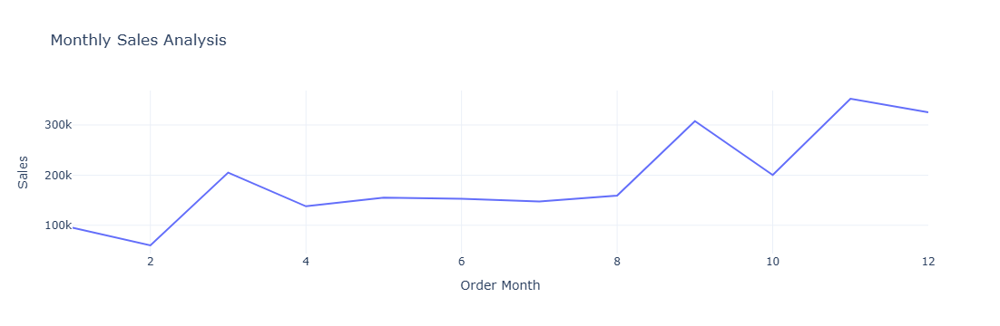

# 📊 E-commerce Sales Analysis

## 📌 Project Overview
This project analyzes an e-commerce sales dataset to extract meaningful business insights. The goal is to leverage Exploratory Data Analysis (EDA) and forecasting techniques to improve decision-making for inventory management, marketing, and operations.

## 📂 Data Source
- The dataset contains transaction details, including:
  - **Order Date, Ship Date, Customer Segment, Sales, Profit, Discount, Shipping Mode**
- Stored in a **CSV file** and analyzed using **Jupyter Notebook**.

## 🛠️ Data Cleaning & Preprocessing
- **Handled missing values** – Checking for null values and imputing or removing them if necessary.
- **Converted data types** – Ensuring proper formats, especially for date columns.
- **Removed duplicates** – Eliminating redundant entries.
- **Created calculated columns**  – Such as Processing Time (Ship Date - Order Date) and Sales-to-Profit Ratio.
- **Filtered anomalies and outliers** – Identifying outliers in sales, profit, and discount columns.

## 📈 Exploratory Data Analysis (EDA)

A series of EDA techniques were applied to gain a deeper understanding of the data:

Completed 9 analyses from Monthly Sales Analysis to Delivery Speed Analysis by Ship Mode:
1.	Monthly Sales Analysis
2.	Sales Analysis by Category
3.	Sales Analysis by Sub-Category
4.	Monthly Profit Analysis
5.	Profit Analysis by Category
6.	Profit Analysis by Sub-Category
7.	Sales and Profit Analysis by Customer Segment
8.	Sales-to-Profit Ratio Analysis
9.	Delivery Speed Analysis by Ship Mode


### 1️⃣ Monthly Sales Analysis
#### 📜 Code:
```python
sales_by_month = data.groupby('Order Month')['Sales'].sum().reset_index()
fig = px.line(sales_by_month, x='Order Month', y='Sales', title='Monthly Sales Analysis')
fig.show()
```

#### 🖼️ Visualization:


#### 📊 Insights:
- Sales peak in March, September, and November.
- There is a mid-year slump in April–July.
- **Action:** Plan promotions during peak months.

### 2️⃣ Sales by Category
#### 📜 Code:
```python
sales_by_category = data.groupby('Category')['Sales'].sum().reset_index()
fig = px.pie(sales_by_category, values='Sales', names='Category', title='Sales by Category')
fig.show()
```

#### 🖼️ Visualization:


#### 📊 Insights:
- Technology leads sales (36.4%), followed by Furniture and Office Supplies.
- **Action:** Focus marketing on high-selling categories.

### 3️⃣ Sales by Sub-Category
#### 📜 Code:
```python
sales_by_subcategory = data.groupby('Sub-Category')['Sales'].sum().reset_index()
fig = px.bar(sales_by_subcategory, x='Sub-Category', y='Sales', title='Sales by Sub-Category')
fig.show()
```

#### 🖼️ Visualization:


#### 📊 Insights:
- Chairs & Phones have the highest sales.
- Art, Fasteners, and Labels show low demand.

### 4️⃣ Profit Analysis by Category
#### 📜 Code:
```python
profit_by_category = data.groupby('Category')['Profit'].sum().reset_index()
fig = px.pie(profit_by_category, values='Profit', names='Category', title='Profit by Category')
fig.show()
```

#### 🖼️ Visualization:


#### 📊 Insights:
- Technology contributes the most profit (50.8%).
- Furniture has the lowest profit margin.

### 5️⃣ Customer Segment Analysis
#### 📜 Code:
```python
sales_profit_by_segment = data.groupby('Segment').agg({'Sales': 'sum', 'Profit': 'sum'}).reset_index()
fig = px.bar(sales_profit_by_segment, x='Segment', y=['Sales', 'Profit'], barmode='group', title='Sales and Profit by Customer Segment')
fig.show()
```

#### 🖼️ Visualization:


#### 📊 Insights:
- Consumer segment generates the highest sales.
- Corporate customers yield higher profit ratios.

### 6️⃣ Sales Forecasting Using Exponential Smoothing
#### 📜 Code:
```python
from statsmodels.tsa.holtwinters import ExponentialSmoothing
sales_data = data.resample('M', on='Order Date').sum()
model = ExponentialSmoothing(sales_data['Sales'], trend='add', seasonal='add', seasonal_periods=12).fit()
sales_data['Forecast'] = model.predict(start=sales_data.index[0], end=sales_data.index[-1])
fig = px.line(sales_data, x=sales_data.index, y=['Sales', 'Forecast'], title='Sales Forecasting')
fig.show()
```

### 8️⃣ Sales-to-Profit Ratio Analysis
#### 📜 Code:
```python
sales_profit_by_segment['Sales_to_Profit_Ratio'] = sales_profit_by_segment['Sales'] / sales_profit_by_segment['Profit']
fig = px.bar(sales_profit_by_segment, x='Segment', y='Sales_to_Profit_Ratio', title='Sales to Profit Ratio by Segment')
fig.show()
```

#### 🖼️ Visualization:


#### 📊 Insights:
- Consumer segment has the highest ratio (8.66), indicating lower profitability.
- Home Office segment has the best profit efficiency.

### 9️⃣ Customer Lifetime Value (CLV) Analysis
#### 📜 Code:
```python
clv = data.groupby("Customer Name")["Sales"].sum().sort_values(ascending=False).head(10)
fig = px.bar(x=clv.values, y=clv.index, title='Top 10 Customers by Lifetime Value')
fig.show()
```

#### 🖼️ Visualization:


#### 📊 Insights:
- Top 10 customers contribute significantly to total sales.
- Sean Miller and Tamara Chand are the most valuable customers.

### 🔟 Regional Sales Performance
#### 📜 Code:
```python
region_sales = data.groupby("Region")["Sales"].sum().sort_values()
fig = px.bar(x=region_sales.index, y=region_sales.values, title='Sales by Region')
fig.show()
```

#### 🖼️ Visualization:


#### 📊 Insights:
- West and East regions dominate in total sales.
- The South region has the lowest sales, indicating growth potential.

### 1️⃣1️⃣ Discount Effectiveness Analysis
#### 📜 Code:
```python
fig, ax = plt.subplots(figsize=(10, 6))
sns.scatterplot(x=data['Discount'], y=data['Profit'], alpha=0.6, ax=ax)
ax.set_xlabel("Discount")
ax.set_ylabel("Profit")
ax.set_title("Impact of Discounts on Profit")
plt.show()
```

#### 🖼️ Visualization:


#### 📊 Insights:
- Higher discounts (>50%) reduce profitability.
- Lower discounts (0-20%) generate better profit margins.

### 1️⃣2️⃣ Order Processing Efficiency Analysis
#### 📜 Code:
```python
data['Processing Time'] = (data['Ship Date'] - data['Order Date']).dt.days
fig, ax = plt.subplots(figsize=(10, 6))
sns.histplot(data['Processing Time'], bins=20, kde=True, ax=ax)
ax.set_xlabel("Processing Time (days)")
ax.set_ylabel("Frequency")
ax.set_title("Distribution of Order Processing Time")
plt.show()
```

#### 🖼️ Visualization:


#### 📊 Insights:
- Most orders are processed within 2-5 days.
- Some orders experience delays beyond 5 days.

### 1️⃣3️⃣ Sales Forecasting Using Exponential Smoothing
#### 📜 Code:
```python
model = ExponentialSmoothing(sales_data['Sales'], trend='add', seasonal='add', seasonal_periods=12).fit()
sales_data['Forecast'] = model.predict(start=sales_data.index[0], end=sales_data.index[-1])
fig = px.line(sales_data, x=sales_data.index, y=['Sales', 'Forecast'], title='Sales Forecasting')
fig.show()
```

#### 🖼️ Visualization:


#### 📊 Insights:
- Seasonal trends exist, affecting inventory and marketing strategies.

### 1️⃣4️⃣ Delivery Speed Analysis by Ship Mode
#### 📜 Code:
```python
ship_mode_avg = data.groupby('Ship Mode')['Processing Time'].mean().sort_values()
fig = px.bar(x=ship_mode_avg.index, y=ship_mode_avg.values, title='Average Delivery Time by Ship Mode')
fig.show()
```

#### 🖼️ Visualization:


#### 📊 Insights:
- Same-day delivery is the fastest.
- Standard shipping takes the longest.

## ✅ Recommendations
1. **Optimize inventory** based on peak demand months.
2. **Adjust discount strategies** to prevent profit erosion.
3. **Improve order fulfillment** to reduce shipping delays.
4. **Encourage faster shipping modes** to improve customer experience.
5. **Refine forecasting models** for better business predictions.

## 🖥️ Technologies Used
- **Python** (Pandas, NumPy, Matplotlib, Seaborn, Statsmodels, Plotly, Scikit-learn)
- **Jupyter Notebook**
- **Time Series Forecasting (Exponential Smoothing)**

## 📂 Repository Structure
```
📂 E-commerce-Sales-Analysis
│── 📜 README.md  # Project Overview
│── 📜 dataset.csv  # Raw data file
│── 📜 e_commerce_analysis.ipynb  # Jupyter Notebook with full analysis
│── 📂 images/  # Visualizations from EDA
│── 📂 results/  # Processed data and outputs
```

## 📢 How to Use
1. Clone the repository:
   ```bash
   git clone https://github.com/your-username/E-commerce-Sales-Analysis.git
   ```
2. Open Jupyter Notebook and run `e_commerce_analysis.ipynb`.
3. Load `dataset.csv` and explore the insights.

## 📧 Contact
For questions or collaborations, feel free to reach out via [GitHub Issues](https://github.com/your-username/E-commerce-Sales-Analysis/issues).

---

🚀 **Happy Analyzing!** 🎯
