# 📊 E-commerce Sales Analysis

## 📌 Project Overview
This project analyzes an e-commerce sales dataset to extract meaningful business insights. The goal is to leverage Exploratory Data Analysis (EDA) and forecasting techniques to improve decision-making for inventory management, marketing, and operations.

## 📂 Data Source
- The dataset **Sample - Superstore.csv** contains transaction details, including:
  - **Order Date, Ship Date, Customer Segment, Sales, Profit, Discount, Shipping Mode**
- Stored in a **CSV file** and analyzed using **Jupyter Notebook**.

## 🛠️ Data Cleaning & Preprocessing
- **Handled missing values** – Checking for null values and imputing or removing them if necessary.
- **Converted data types** – Ensuring proper formats, especially for date columns.
- **Removed duplicates** – Eliminating redundant entries.
- **Created calculated columns**  – Such as Processing Time (Ship Date - Order Date) and Sales-to-Profit Ratio.
- **Filtered anomalies and outliers** – Identifying outliers in sales, profit, and discount columns.

## 📈 Exploratory Data Analysis (EDA)

A series of EDA techniques were applied to gain a deeper understanding of the data:

Completed 14 analyses from Monthly Sales Analysis to Delivery Speed Analysis by Ship Mode:

1.	Monthly Sales Analysis
2.	Sales Analysis by Category
3.	Sales Analysis by Sub-Category
4.	Monthly Profit Analysis
5.	Profit Analysis by Category
6.	Profit Analysis by Sub-Category
7.	Sales and Profit Analysis by Customer Segment
8.	Sales-to-Profit Ratio Analysis
9.	Customer Lifetime Value (CLV) Analysis
10.	Regional Sales Performance
11.	Discount Effectiveness Analysis
12.	Order Processing Efficiency Analysis
13.	Sales Forecasting Using Exponential Smoothing
14.	Delivery Speed Analysis by Ship Mode


### 1️⃣ Monthly Sales Analysis
#### 📜 Code:
```python
sales_by_month = data.groupby('Order Month')['Sales'].sum().reset_index()
fig = px.line(sales_by_month, x='Order Month', y='Sales', title='Monthly Sales Analysis')
fig.show()
```

#### 🖼️ Visualization:
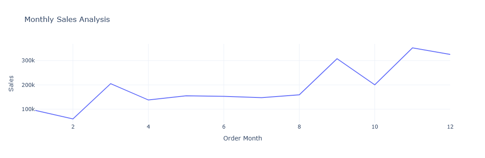

#### 📊 Insights:
- Sales fluctuate throughout the year, showing both growth and decline phases.
- There is a significant increase around March (Month 3), peaking above 200K.
- A gradual dip follows in the middle months (April to July), indicating a slower period.
- Sales recover strongly in September (Month 9), with a sharp rise towards the year's end.

#### 🔍 Key Takeaways:

- Seasonal trends exist, with notable peaks in March, September, and November.
- Businesses can leverage high-demand months with promotions and stock planning.
- The mid-year dip may indicate a need for marketing strategies or seasonal factors affecting demand.

### 2️⃣ Sales Analysis by Category
#### 📜 Code:
```python
sales_by_category = data.groupby('Category')['Sales'].sum().reset_index()
fig = px.pie(sales_by_category, 
             values='Sales', 
             names='Category', 
             hole=0.5, 
             color_discrete_sequence=px.colors.qualitative.Pastel)
fig.update_traces(textposition='inside', textinfo='percent+label')
fig.update_layout(title_text='Sales Analysis by Category', title_font=dict(size=24))
fig.show()
```

#### 🖼️ Visualization:


#### 📊 Insights:
- Technology contributes the highest (36.4%), making it the most significant revenue driver.
- Furniture follows closely (32.3%), showing a strong sales presence.
- Office Supplies account for 31.3%, indicating relatively balanced sales across categories.

#### 🔍 Key Takeaways:

- Technology dominates sales, implying a high demand for tech-related products.
- The sales distribution is fairly balanced, suggesting no single category overwhelmingly drives revenue.

### 3️⃣ Sales Analysis by Sub-Category
#### 📜 Code:
```python
sales_by_subcategory = data.groupby('Sub-Category')['Sales'].sum().reset_index()
fig = px.bar(sales_by_subcategory, x='Sub-Category', y='Sales', title='Sales by Sub-Category')
fig.show()
```

#### 🖼️ Visualization:
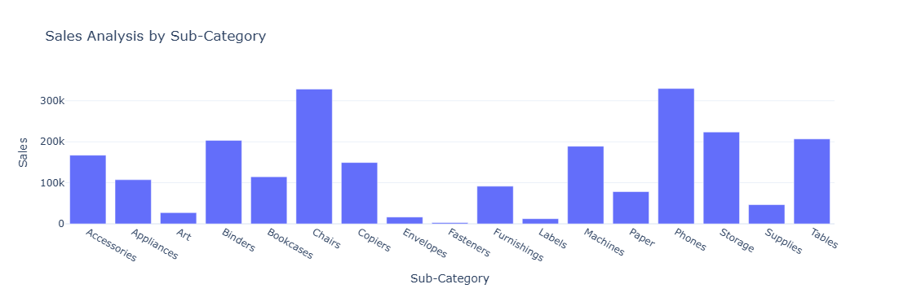

#### 📊 Insights:
- Chairs & Phones have the highest sales, indicating high demand in the furniture and technology sectors.
- Binders, Machines, and Tables also contribute significantly to overall sales.
- Binders, Machines, and Tables also contribute significantly to overall sales.

#### 🔍 Key Takeaways:
- High-performing sub-categories should be prioritized for inventory management and promotional campaigns.
- Low-performing sub-categories may require strategic pricing, marketing boosts, or reconsideration of stock levels.
- The variation in sales across sub-categories highlights customer preferences and potential seasonal trends.

### 4️⃣ Monthly Profit Analysis
#### 📜 Code:
```python
profit_by_month = data.groupby('Order Month')['Profit'].sum().reset_index()
fig = px.line(profit_by_month, 
              x='Order Month', 
              y='Profit', 
              title='Monthly Profit Analysis')
fig.show()
```

#### 🖼️ Visualization:
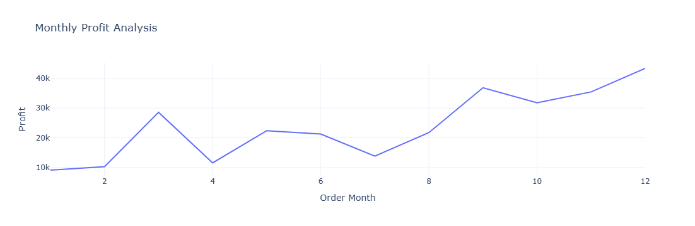

#### 📊 Insights:
- Profit shows an overall increasing trend throughout the year.
- March and September have noticeable profit spikes, indicating potential seasonal demand or successful sales strategies.
- April and July show a dip, suggesting lower-margin sales or higher costs during these months.
- The last quarter (Oct-Dec) shows strong profit growth, possibly due to holiday season sales.

#### 🔍 Key Takeaways:

- Months with lower profits should be analyzed for possible causes (e.g., discounts, increased costs).
- High-profit months can indicate successful promotions or seasonal trends, which should be leveraged in future planning.
- End-of-year profitability suggests increased consumer spending, emphasizing the need for stock readiness and marketing efforts.

### 5️⃣ Profit Analysis by Category
#### 📜 Code:
```python
profit_by_category = data.groupby('Category')['Profit'].sum().reset_index()

fig = px.pie(profit_by_category, 
             values='Profit', 
             names='Category', 
             hole=0.5, 
             color_discrete_sequence=px.colors.qualitative.Pastel)

fig.update_traces(textposition='inside', textinfo='percent+label')
fig.update_layout(title_text='Profit Analysis by Category', title_font=dict(size=24))

fig.show()
```

#### 🖼️ Visualization:
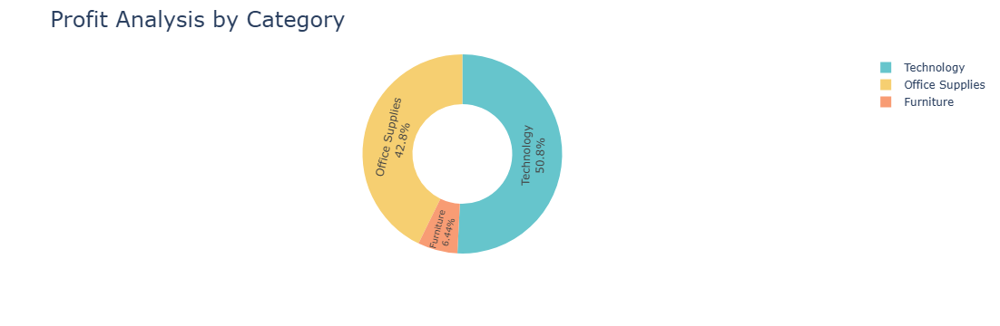

#### 📊 Insights:
- Technology contributes the most to profit (50.8%), indicating high-margin products or strong sales volume.
- Office Supplies follows closely at 42.8%, suggesting a steady demand and profitability.
- Furniture lags behind with only 6.4%, which may indicate either low sales volume or high operational costs reducing profitability.

#### 🔍 Key Takeaways:

- Technology and Office Supplies should remain priority categories for maximizing profits.
- Furniture requires further investigation—are high costs affecting margins, or is demand lower?
- If Furniture has high sales but low profit, consider adjusting pricing or cost management strategies.

### 6️⃣ Profit Analysis by Sub-Category
#### 📜 Code:
```python
profit_by_subcategory = data.groupby('Sub-Category')['Profit'].sum().reset_index()
fig = px.bar(profit_by_subcategory, x='Sub-Category', 
             y='Profit', 
             title='Profit Analysis by Sub-Category')
fig.show()
```

#### 🖼️ Visualization:
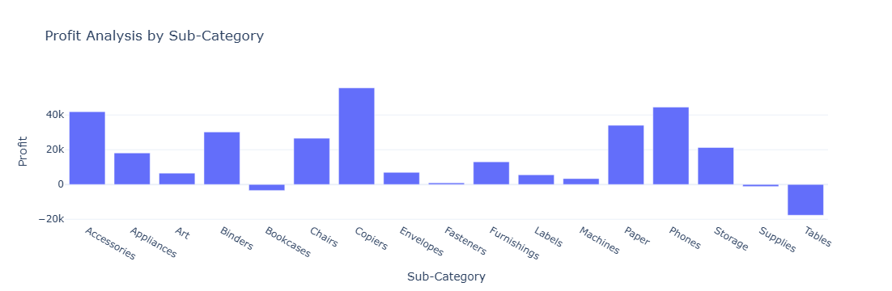

#### 📊 Insights:
- The highest profit is observed in the "Copiers" sub-category, followed by "Accessories", "Paper", and "Chairs".
- "Tables" sub-category is operating at a loss, showing a negative profit margin.
- Other sub-categories like "Supplies" and "Storage" also appear to have little to no profit.
- "Phones", "Binders", and "Bookcases" contribute moderately to overall profits.
- Some categories, like "Fasteners", "Labels", and "Machines", have relatively low profit contributions.

#### 🔍 Key Takeaways:
- High-Profit Items: Focus on boosting sales of "Copiers," "Accessories," and "Paper", as they yield significant profits.
- Loss-Making Categories: "Tables" and "Supplies" need pricing adjustments or cost reductions.
- Optimization Strategy: Reevaluate inventory, marketing, and pricing strategies for mid-performing categories to enhance profitability.

### 7️⃣ Sales and Profit Analysis by Customer Segment
#### 📜 Code:
```python
sales_profit_by_segment = data.groupby('Segment').agg({'Sales': 'sum', 'Profit': 'sum'}).reset_index()

color_palette = colors.qualitative.Pastel

fig = go.Figure()
fig.add_trace(go.Bar(x=sales_profit_by_segment['Segment'], 
                     y=sales_profit_by_segment['Sales'], 
                     name='Sales',
                     marker_color=color_palette[0]))

fig.add_trace(go.Bar(x=sales_profit_by_segment['Segment'], 
                     y=sales_profit_by_segment['Profit'], 
                     name='Profit',
                     marker_color=color_palette[1]))

fig.update_layout(title='Sales and Profit Analysis by Customer Segment',
                  xaxis_title='Customer Segment', yaxis_title='Amount')

fig.show()
```

#### 🖼️ Visualization:
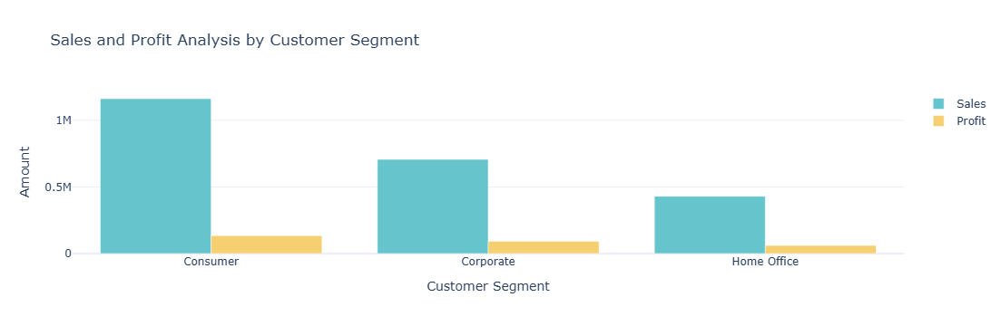

#### 📊 Insights:
- Consumer segment has the highest sales but relatively low profit.
- Corporate segment has balanced sales and profit but a lower profit margin.
- Home Office has the lowest sales but a better profit-to-sales ratio.

#### 🔍Key Takeaways:
- Optimize Consumer Segment: Adjust pricing and discounts to improve profit.
- Enhance Corporate Margins: Focus on cost efficiency.
- Leverage Home Office Profitability: Explore growth opportunities.


### 8️⃣ Sales-to-Profit Ratio Analysis
#### 📜 Code:
```python
sales_profit_by_segment = data.groupby('Segment').agg({'Sales': 'sum', 'Profit': 'sum'}).reset_index()
sales_profit_by_segment['Sales_to_Profit_Ratio'] = sales_profit_by_segment['Sales'] / sales_profit_by_segment['Profit']
plt.figure(figsize=(8, 5))
plt.bar(sales_profit_by_segment['Segment'], sales_profit_by_segment['Sales_to_Profit_Ratio'],)
plt.xlabel('Segment')
plt.ylabel('Sales to Profit Ratio')
plt.title('Sales to Profit Ratio by Segment')
plt.ylim(0, max(sales_profit_by_segment['Sales_to_Profit_Ratio']) * 1.2)  # Adjust limit for better visibility
plt.grid(axis='y', linestyle='--', alpha=0.7)

# Show values on bars
for i, ratio in enumerate(sales_profit_by_segment['Sales_to_Profit_Ratio']):
    plt.text(i, ratio + 0.2, f'{ratio:.2f}', ha='center', fontsize=12)

plt.show()
```

#### 🖼️ Visualization:
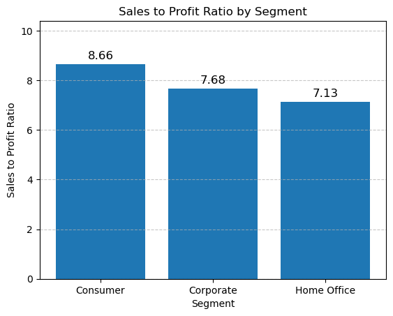

#### 📊 Insights:
- Consumer Segment has the highest Sales to Profit Ratio at 8.66, indicating that it generates the most sales relative to profit.
- Corporate Segment follows with a ratio of 7.68, showing efficient sales but slightly lower profitability compared to the Consumer segment.
- Home Office Segment has the lowest ratio at 7.13, meaning it is less efficient in converting sales into profit compared to the other segments.

#### 🔍 Key Takeaways:
- High Ratio in Consumer Segment: This suggests strong sales but possibly lower profit margins, indicating a need for cost optimization or pricing adjustments.
- Corporate Segment Stability: A balanced sales-to-profit ratio, meaning a steady revenue stream with a reasonable profit margin.
- Home Office Needs Attention: Since this segment has the lowest ratio, it might need better pricing strategies, cost reduction, or increased sales efforts.


### 9️⃣ Customer Lifetime Value (CLV) Analysis
#### 📜 Code:
```python
clv = data.groupby("Customer Name")["Sales"].sum().sort_values(ascending=False).head(10)
plt.figure(figsize=(12, 6))
sns.barplot(x=clv.values, y=clv.index, hue=clv.index, palette="viridis", legend=False)
plt.xlabel("Total Sales")
plt.ylabel("Customer Name")
plt.title("Top 10 Customers by Lifetime Value")
plt.show()
```

#### 🖼️ Visualization:
Analysis.png)

#### 📊 Insights:
- Sean Miller is the highest-value customer, significantly ahead of others.
- Tamara Chand follows, maintaining a strong contribution to total sales.
- Raymond Buch, Tom Ashbrook, and Adrian Barton also play a crucial role in revenue.
- The remaining five customers contribute steadily but with a noticeable gap from the top two.

#### 🔍 Key Takeaways:
- High-Value Customers: Prioritize engagement with Sean Miller and Tamara Chand to maintain loyalty.
- Growth Opportunities: Develop retention strategies for mid-tier customers (Raymond, Tom, Adrian) to increase their spending.
- Customer Segmentation: Personalized offers for lower-tier customers may boost lifetime value.

### 🔟 Regional Sales Performance
#### 📜 Code:
```python
region_sales = data.groupby("Region")["Sales"].sum().sort_values()
plt.figure(figsize=(12, 6))
sns.barplot(x=region_sales.index, y=region_sales.values, hue=region_sales.index, palette="coolwarm", legend=False)
plt.xlabel("Region")
plt.ylabel("Total Sales")
plt.title("Sales by Region")
plt.show()
```

#### 🖼️ Visualization:
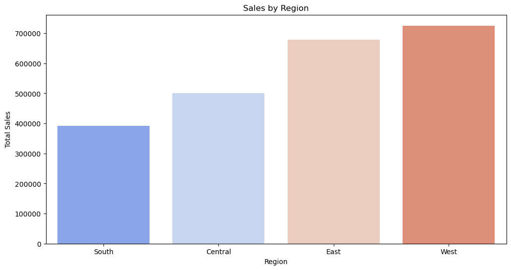

#### 📊 Insights:
- The West region has the highest total sales, surpassing all other regions.
- The East region follows closely behind, showing strong sales performance.
- The Central region has moderate sales, trailing behind the East and West.
- The South region has the lowest sales, significantly lagging behind the other regions.

#### 🔍 Key Takeaways:
- Regional Performance: The West and East regions are the strongest performers and should be prioritized for further growth opportunities.
- Improvement Areas: The South region needs targeted strategies to boost sales and close the gap with other regions.
- Strategic Focus: Investing in marketing, promotions, or distribution improvements in the Central region could help enhance its contribution.


### 1️⃣1️⃣ Discount Effectiveness Analysis
#### 📜 Code:
```python
fig, ax = plt.subplots(figsize=(10, 6))
sns.scatterplot(x=data['Discount'], y=data['Profit'], alpha=0.6, ax=ax)
ax.set_xlabel("Discount")
ax.set_ylabel("Profit")
ax.set_title("Impact of Discounts on Profit")
plt.show()
```

#### 🖼️ Visualization:
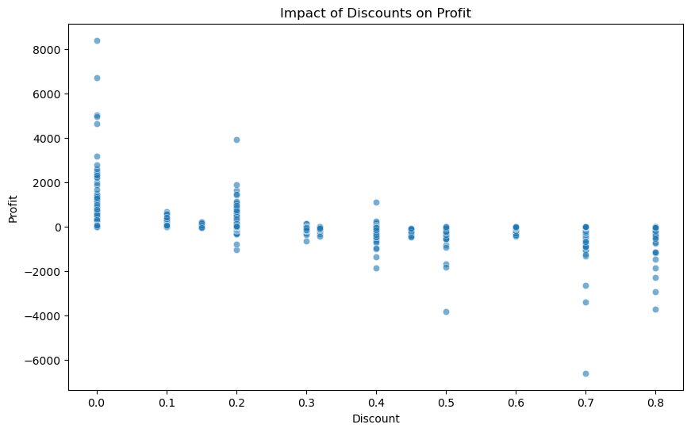

#### 📊 Insights:
- There is a declining trend in profit as the discount increases.
- At 0% discount, profits tend to be higher, with several high-profit transactions.
- As the discount increases beyond 20%, profit margins shrink significantly, with several transactions resulting in losses.
- Higher discount levels (50% and above) show more frequent negative profit values, suggesting diminishing returns or potential losses.

#### 🔍 Key Takeaways:
- Optimal Discounting: Lower discount levels (0-20%) appear to maintain profitability, while higher discounts should be carefully evaluated.
- Profit Erosion: Excessive discounting leads to negative profits, indicating that deep discounts may not be sustainable.
- Strategic Pricing: A data-driven pricing strategy should be implemented to balance competitive pricing and profit sustainability.


### 1️⃣2️⃣ Order Processing Efficiency Analysis
#### 📜 Code:
```python
data['Processing Time'] = (data['Ship Date'] - data['Order Date']).dt.days
fig, ax = plt.subplots(figsize=(10, 6))
sns.histplot(data['Processing Time'], bins=20, kde=True, ax=ax)
ax.set_xlabel("Processing Time (days)")
ax.set_ylabel("Frequency")
ax.set_title("Distribution of Order Processing Time")
plt.show()
```

#### 🖼️ Visualization:
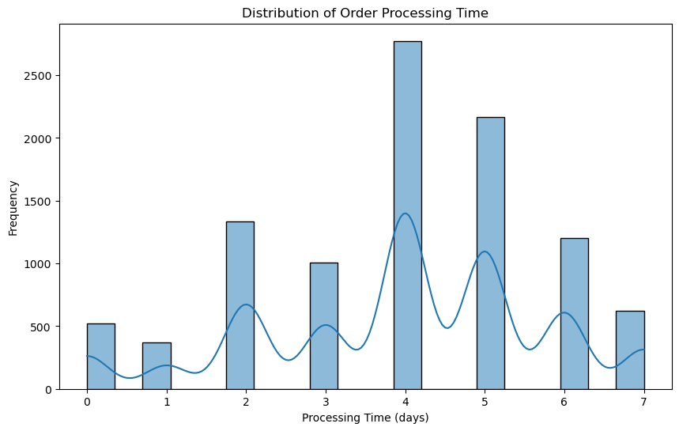

#### 📊 Insights:
- The processing time varies between 0 to 7 days, with distinct peaks at 2, 4, and 5 days.
- The highest frequency occurs at 4 days, indicating that most orders are processed within this time frame.
- Some orders are processed instantly (0-1 days), but they are relatively rare.
- A significant number of orders take 6-7 days, which might indicate delays for certain cases.

#### 🔍 Key Takeaways
- Efficiency Benchmark: The majority of orders are processed in 4-5 days, suggesting a standard timeframe for fulfillment.
- Optimization Areas: Reducing processing time beyond 4 days could improve overall efficiency and customer satisfaction.
- Delays Analysis: Orders taking 6-7 days should be analyzed to identify bottlenecks and streamline processes.

### 1️⃣3️⃣ Sales Forecasting Using Exponential Smoothing
#### 📜 Code:
```python
# Ensure 'Sales' is numeric
data['Sales'] = pd.to_numeric(data['Sales'], errors='coerce')

# Resample sales data
data_sales = data.resample('ME', on='Order Date').sum(numeric_only=True)

# Apply Exponential Smoothing
model = ExponentialSmoothing(data_sales['Sales'], trend='add', seasonal='add', seasonal_periods=12).fit()
data_sales['Forecast'] = model.predict(start=data_sales.index[0], end=data_sales.index[-1])
plt.figure(figsize=(12, 6))
plt.plot(data_sales.index, data_sales['Sales'], label="Actual Sales", marker='o')
plt.plot(data_sales.index, data_sales['Forecast'], label="Forecasted Sales", linestyle="dashed")
plt.xlabel("Month")
plt.ylabel("Sales")
plt.title("Sales Forecasting using Exponential Smoothing")
plt.legend()
plt.show()
```

#### 🖼️ Visualization:
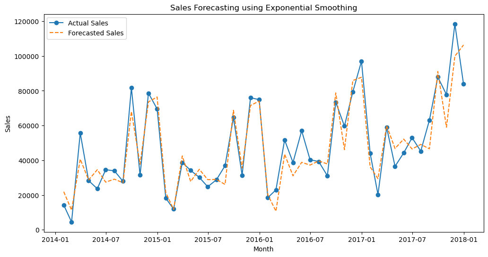

#### 📊 Insights:
- The sales data shows seasonal patterns with noticeable peaks and troughs throughout the time period.
- The forecasted sales (orange dashed line) follow the actual sales (solid blue line) closely, indicating that the exponential smoothing model captures trends well.
- There are some deviations, particularly during sharp spikes in actual sales, where the forecast lags.
- The upward trend in sales is apparent starting from mid-2016, with higher peaks observed closer to the end of the period.

#### 🔍 Key Takeaways:
- Model Performance: The exponential smoothing model effectively tracks general sales trends, though it struggles with sharp changes in demand.
- Trend Detection: Sales are on an upward trajectory over time, suggesting business growth or seasonal factors driving increased demand.
- Forecast Improvement: Further model tuning or incorporating additional data (such as external factors) could enhance accuracy, particularly around extreme sales spikes.
- Seasonal Insights: Understanding these peaks could help in better resource allocation and inventory planning.

### 1️⃣4️⃣ Delivery Speed Analysis by Ship Mode
#### 📜 Code:
```python
data['Delivery Time'] = (data['Ship Date'] - data['Order Date']).dt.days
ship_mode_avg = data.groupby('Ship Mode')['Delivery Time'].mean().sort_values()
plt.figure(figsize=(10, 6))
sns.barplot(x=ship_mode_avg.index, y=ship_mode_avg.values, hue=ship_mode_avg.index, palette="coolwarm", legend=False)
plt.xlabel("Ship Mode")
plt.ylabel("Average Delivery Time (days)")
plt.title("Average Delivery Time by Ship Mode")
plt.show()
```

#### 🖼️ Visualization:
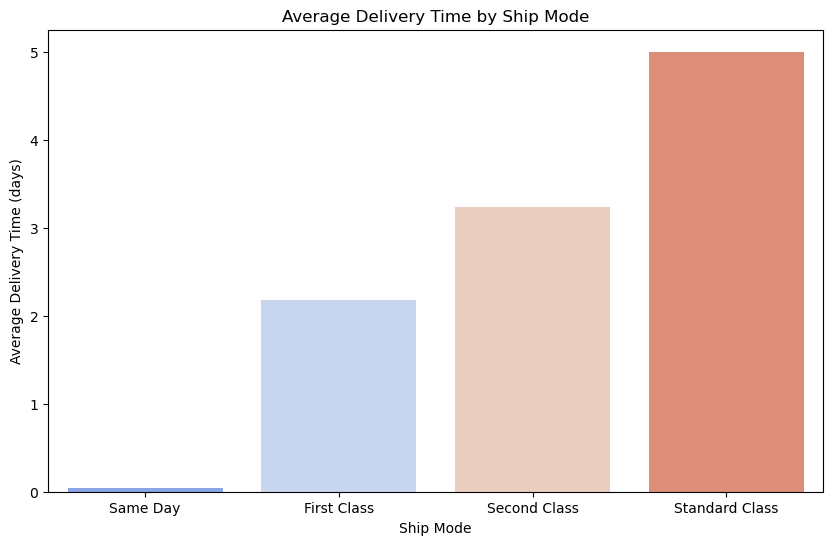

#### 📊 Insights:
- Same Day Delivery: Offers the quickest delivery with an almost negligible average delivery time, making it ideal for urgent orders.
- First Class: Has an average delivery time of approximately 2 days, providing a fast and efficient option for customers seeking expedited service.
- Second Class: Takes around 3 days on average, offering a balance between speed and cost.
- Standard Class: Has the longest average delivery time at about 5 days, likely being the most cost-effective option.

#### 🔍 Key Takeaways:
- Service Efficiency: Same Day and First Class shipping modes are critical for time-sensitive deliveries and likely enhance customer satisfaction.
- Customer Segmentation: Different delivery modes cater to distinct customer priorities—urgency for Same Day and First Class, cost savings for Standard Class.
- Optimization Opportunity: Standard Class delivery time could be analyzed for efficiency improvements without significantly increasing costs.
- Delivery Strategy: Maintaining a mix of delivery options supports diverse customer needs and competitive market positioning.

## ✅ Recommendations
1. **Optimize inventory** based on peak demand months.
2. **Adjust discount strategies** to prevent profit erosion.
3. **Improve order fulfillment** to reduce shipping delays.
4. **Encourage faster shipping modes** to improve customer experience.
5. **Refine forecasting models** for better business predictions.

## 🖥️ Technologies Used
- **Python** (Pandas, NumPy, Matplotlib, Seaborn, Statsmodels, Plotly, Scikit-learn)
- **Jupyter Notebook**
- **Time Series Forecasting (Exponential Smoothing)**


🚀 **Happy Analyzing!** 🎯
